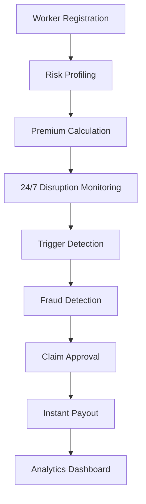

# 🛡️ Kavach: AI-Powered Insurance for E-commerce Delivery Partners

<div align="center">
  
</div>

[](https://opensource.org/licenses/MIT)
[](https://github.com/Devansh-407/kavach)
[](https://github.com/Devansh-407/kavach)

> *"When it rains heavily, I can't deliver. When there's a curfew, I can't deliver. When the app crashes, I can't deliver. Those days, I earn ZERO rupees."* - Rajesh, 28, Amazon Flex delivery partner, Mumbai

> **AI-Powered Parametric Insurance Platform for E-commerce Delivery Partners**

---

## 🎯 The Problem

**15-20 days per year lost to external disruptions**
- **₹12,000-15,000 annual income loss** per delivery partner
- **No safety net** — no paid leaves, no sick days, no insurance
- **Stress and uncertainty** affecting mental health of millions

For India's 10+ million e-commerce delivery partners, one bad day means skipping meals or borrowing money to survive.

## 💡 Our Solution: Kavach

**Kavach** is an AI-powered parametric insurance platform that automatically compensates e-commerce delivery partners when external disruptions prevent them from working. 

**No paperwork, no manual claims, no delays** — just instant income protection when they need it most.

---

## 🏗️ Architecture Overview

```
┌─────────────────┐    ┌─────────────────┐    ┌─────────────────┐
│   Frontend      │    │    Backend      │    │   AI/ML Service │
│   (React)       │◄──►│   (Node.js)     │◄──►│   (Python)      │
│                 │    │                 │    │                 │
│ • Mobile App    │    │ • REST API      │    │ • Risk Models   │
│ • Dashboard     │    │ • WebSocket     │    │ • Fraud Detection│
│ • Admin Panel   │    │ • Queue Jobs    │    │ • Anomaly AI    │
└─────────────────┘    └─────────────────┘    └─────────────────┘
         │                       │                       │
         └───────────────────────┼───────────────────────┘
                                 │
                    ┌─────────────────┐
                    │   Infrastructure │
                    │                 │
                    │ • PostgreSQL    │
                    │ • Redis         │
                    │ • Docker        │
                    │ • Kubernetes    │
                    └─────────────────┘
```

---

## 🚀 Key Features (Phase 1 - MVP)

### ⚡ Instant Parametric Payouts
- **Auto-trigger** within 15 minutes of disruption
- **80% of daily earnings** credited directly to wallet
- **Zero paperwork** - completely automated
- **UPI Integration**: Direct bank transfers within 1 hour

### 🤖 Multi-Layer AI Protection
- **Weather API integration** (rain, heat, AQI)
- **Crowd-sourced verification** with geotagged images
- **Platform downtime detection**
- **News/government alert monitoring**
- **Real-time Monitoring**: 24/7 disruption detection

### 🛡️ Advanced Fraud Detection
- **Digital signature verification** (video/voice biometrics)
- **GPS location validation**
- **Pattern recognition AI**
- **Network analysis for organized fraud
- **Multi-Layer Authentication**: JWT, phone verification, biometrics

### 📱 Mobile-First Design
- **Android app** (90% of delivery partners)
- **Works offline** in low-network areas
- **Regional language support**
- **UPI integration** for seamless payments
- **Real-time Alerts**: Push notifications for claims and payouts

---

## 📊 Real-World Impact (Planned)

### Scenario 1: Heavy Rain in Mumbai
```
Worker: Rajesh, Andheri East (Pincode: 400069)
Rainfall: 45mm in 2 hours
⚡ 8:00 AM: Weather API detects >35mm rain
⚡ 8:15 AM: Rajesh gets ₹960 (80% of lost income)
Result: Family fed despite not working
```

### Scenario 2: Sudden Curfew in Delhi
```
Worker: Priya, Jamia Nagar (Pincode: 110025)
8 workers report barricades in 15 minutes
⚡ 12:50 PM: Auto-trigger for entire pincode (312 workers)
⚡ 1:00 PM: Priya gets ₹440 for lost afternoon shift
Result: Community verification ensures genuine claims
```

---

## 💰 Sustainable Business Model

### Premium: "Pay As You Earn"
```
Weekly Premium = (Avg Weekly Deliveries × ₹5) × Location Risk Factor
Weekly Cap: ₹1,000 maximum
```

**Why ₹5 per delivery?**
- ✅ Simple: "Each delivery = 5 rupees safety"
- ✅ Fair: More deliveries = More risk = More premium
- ✅ Affordable: Only 1-2% of earnings
- ✅ Predictable: Worker knows exact cost per delivery

### Risk-Based Pricing
| City Tier | Risk Score | Multiplier | Examples |
|-----------|------------|------------|----------|
| Low Risk  | 0.0-0.2    | 0.8x       | Jaipur, Pune, Indore |
| Medium Risk | 0.2-0.5  | 1.0x       | Bangalore, Hyderabad |
| High Risk | 0.5-0.8    | 1.3x       | Mumbai, Delhi, Kolkata |
| Very High | 0.8-1.0    | 1.6x       | Coastal areas, flood zones |

---

## 🚀 Technology Stack (Phase 1)

### Frontend (React TypeScript)
**Why React 18?**
- ✅ **Component-based architecture** for reusable UI elements
- ✅ **Large ecosystem** with extensive libraries
- ✅ **Excellent TypeScript support** for type safety
- ✅ **React Native compatibility** for future mobile app
- ✅ **Strong community support** and documentation

**Why Redux Toolkit?**
- ✅ **Predictable state management** for complex insurance logic
- ✅ **Time-travel debugging** for claim state issues
- ✅ **Middleware support** for authentication and logging
- ✅ **DevTools integration** for development experience

**Why Tailwind CSS?**
- ✅ **Utility-first CSS** for rapid UI development
- ✅ **Mobile-responsive design** out of the box
- ✅ **Customizable themes** for brand consistency
- ✅ **Small bundle size** for faster load times

### Backend (Node.js Express)
**Why Node.js 20?**
- ✅ **Latest LTS version** with long-term support
- ✅ **Excellent performance** for real-time processing
- ✅ **Large npm ecosystem** for insurance libraries
- ✅ **Native TypeScript support** for type safety
- ✅ **Event-driven architecture** perfect for WebSocket

**Why Express.js?**
- ✅ **Minimal and flexible** for custom insurance logic
- ✅ **Extensive middleware** ecosystem
- ✅ **WebSocket integration** via Socket.io
- ✅ **Production-proven** with millions of apps
- ✅ **Easy testing** and debugging

**Why Prisma ORM?**
- ✅ **Type-safe database access** with TypeScript
- ✅ **Auto-generated client** reduces boilerplate
- ✅ **Multi-database support** for future scaling
- ✅ **Excellent migration system** for schema changes
- ✅ **Built-in connection pooling** for performance

**Why Redis?**
- ✅ **In-memory caching** for fast API responses
- ✅ **Session storage** for user authentication
- ✅ **Pub/Sub messaging** for real-time updates
- ✅ **Rate limiting** capabilities
- ✅ **Excellent Node.js integration**

### AI/ML Service (Python)
**Why Python 3.11?**
- ✅ **Latest stable version** with performance improvements
- ✅ **Extensive ML ecosystem** (TensorFlow, scikit-learn)
- ✅ **FastAPI framework** for high-performance APIs
- ✅ **Excellent data science libraries** (pandas, numpy)
- ✅ **Easy deployment** with Docker

**Why TensorFlow?**
- ✅ **Industry standard** for deep learning
- ✅ **Production-ready** with proven scalability
- ✅ **GPU acceleration** for model training
- ✅ **Mobile deployment** for edge inference
- ✅ **Extensive pre-trained models** for fraud detection

**Why FastAPI?**
- ✅ **Automatic API documentation** with OpenAPI
- ✅ **Type hints** for better IDE support
- ✅ **High performance** async/await support
- ✅ **Easy integration** with React frontend
- ✅ **Built-in validation** and serialization

---

## 📁 Phase 1 Project Structure

```
kavach-platform/
├── frontend/                 # React TypeScript frontend
│   ├── src/
│   │   ├── components/       # Reusable UI components
│   │   ├── pages/           # Page components
│   │   │   ├── LandingPage.tsx
│   │   │   ├── DashboardPage.tsx
│   │   │   ├── HowItWorksPage.tsx
│   │   │   └── CoveragePage.tsx
│   │   ├── hooks/           # Custom React hooks
│   │   ├── services/        # API services
│   │   ├── store/           # Redux store
│   │   └── utils/           # Utility functions
│   ├── public/
│   ├── package.json
│   └── vite.config.js
├── backend/                  # Node.js Express backend
│   ├── src/
│   │   ├── controllers/     # Route controllers
│   │   ├── models/          # Data models
│   │   ├── services/        # Business logic
│   │   ├── middleware/      # Express middleware
│   │   ├── routes/          # API routes
│   │   ├── websocket/       # WebSocket handlers
│   │   ├── config/          # Configuration files
│   │   └── jobs/            # Background jobs
│   ├── prisma/              # Database schema
│   ├── package.json
│   └── .env.example
├── ai-ml-service/           # Python AI/ML service
│   ├── src/
│   │   ├── main.py
│   │   ├── services/
│   │   │   ├── risk_prediction_service.py
│   │   │   ├── fraud_detection_service.py
│   │   │   └── anomaly_detection_service.py
│   │   └── models/
│   ├── requirements.txt
│   └── Dockerfile
├── infrastructure/          # Deployment configs
│   ├── kubernetes/          # K8s manifests
│   ├── terraform/           # Infrastructure as code
│   └── monitoring/          # Monitoring setup
├── docs/                    # Documentation
│   └── deployment/
│       └── deployment-guide.md
├── docker-compose.yml       # Full stack deployment
├── .gitignore
└── README.md
```

---

## 🔄 Phase 1 Workflow



### 4-Step Claim Process
1. **🌐 Auto-Detection**: Weather/news/crowd triggers
2. **🤖 AI Verification**: Multi-layer fraud checks
3. **⚡ Instant Approval**: >70% confidence = auto-payout
4. **💸 Immediate Transfer**: UPI/bank within 1 hour

---

## 📊 Database Schema

The platform uses a comprehensive PostgreSQL schema with the following key entities:

- **Users**: Delivery partners with verification status
- **Claims**: Parametric insurance claims with AI verification
- **Premiums**: Weekly premium calculations and payments
- **WeatherEvents**: Real-time weather monitoring data
- **FraudAlerts**: AI-detected fraud patterns
- **Partners**: E-commerce company integrations

---

## 🔌 Phase 1 API Endpoints

### Authentication
```typescript
POST /api/auth/login          # User login with phone/OTP
POST /api/auth/signup         # New user registration
POST /api/auth/verify-otp      # OTP verification
POST /api/auth/refresh         # JWT token refresh
```

### Claims
```typescript
GET /api/claims              # List user claims
GET /api/claims/:id          # Get claim details
POST /api/claims/trigger     # Manual trigger (admin)
GET /api/claims/stats        # Claim statistics
```

### Weather Monitoring
```typescript
GET /api/weather/current     # Current weather data
GET /api/weather/forecast    # Weather forecast
POST /api/weather/trigger    # Manual weather trigger
```

### Admin
```typescript
GET /api/admin/fraud-alerts  # Fraud detection alerts
GET /api/admin/analytics     # Dashboard analytics
POST /api/admin/triggers     # Create manual triggers
```

---

## 🤖 Phase 1 AI/ML Models

### Risk Prediction Model
- **Features**: Location history, weather patterns, delivery frequency
- **Algorithm**: XGBoost with time-series features
- **Output**: Risk score (0-1) for premium calculation
- **Training Data**: Historical claims and weather data

### Fraud Detection Model
- **Features**: GPS patterns, claim timing, image metadata
- **Algorithm**: Deep learning with anomaly detection
- **Output**: Fraud probability and confidence score
- **Training Data**: Verified claims vs. fraudulent attempts

### Weather Prediction
- **Features**: Historical weather, seasonal patterns
- **Algorithm**: Prophet time-series forecasting
- **Output**: 7-day weather disruption probability
- **Data Sources**: OpenWeatherMap, IMD APIs

---

## 🔒 Phase 1 Security Features

### Multi-Layer Authentication
- **JWT Tokens**: Secure token-based authentication
- **Phone Verification**: OTP-based user verification
- **Biometric**: Digital signature with voice/facial recognition
- **Role-Based Access**: Admin, partner, user role separation

### Fraud Prevention
- **GPS Validation**: Location spoofing detection
- **Image Verification**: EXIF data and editing detection
- **Pattern Analysis**: AI-powered anomaly detection
- **Network Analysis**: Organized fraud detection

### Data Protection
- **Encryption**: End-to-end data encryption
- **GDPR Compliance**: User data privacy controls
- **Audit Logs**: Complete activity tracking
- **Rate Limiting**: API abuse prevention

---

## 📈 Market Opportunity

### Target Market
- **10+ million** e-commerce delivery partners in India
- **₹3,000-10,000** weekly income per partner
- **Growing 35% YoY** with e-commerce boom

### Revenue Projections
```
Year 1: 50,000 workers × ₹400 avg premium = ₹2.4CR revenue
Year 2: 200,000 workers × ₹400 avg premium = ₹9.6CR revenue
Year 3: 500,000 workers × ₹400 avg premium = ₹24CR revenue
```

### Competitive Advantage
- **First-mover advantage** in delivery partner insurance
- **AI-powered automation** vs manual competitors
- **Parametric model** vs traditional claims process
- **Mobile-first** approach for target demographic

---

## 🛠️ Phase 1 Installation & Setup

### Prerequisites
- Node.js 18+
- Python 3.11+
- PostgreSQL 15+
- Redis 7+
- Docker & Docker Compose

### Quick Start

1. **Clone the repository**
```bash
git clone https://github.com/Devansh-407/kavach.git
cd kavach/kavach-platform
```

2. **Environment Setup**
```bash
# Backend
cd backend
cp .env.example .env
# Edit .env with your credentials

# Frontend
cd ../frontend
cp .env.example .env
# Edit .env with API URLs
```

3. **Database Setup**
```bash
cd backend
npx prisma migrate dev
npx prisma generate
npx prisma db seed
```

4. **Start Services**
```bash
# Start all services with Docker Compose
docker-compose up -d

# Or start individually:
# Backend
cd backend && npm run dev

# Frontend
cd frontend && npm start

# AI/ML Service
cd ai-ml-service && python -m uvicorn src.main:app --reload
```

## 🎯 Phase 1 Development Roadmap

### ✅ Week 1-2: Core Foundation
- ✅ Project setup and architecture
- ✅ Database schema design
- ✅ Basic authentication system
- ✅ Weather API integration
- ✅ Frontend UI components

### ✅ Week 3-4: MVP Features
- ✅ Claim processing system
- ✅ Basic fraud detection
- ✅ Mobile-responsive design
- ✅ UPI integration simulation
- ✅ Real-time notifications

### 🔄 Week 5-6: Advanced Features
- 🔄 AI-powered risk assessment
- 🔄 Advanced fraud detection
- 🔄 Platform integrations
- 🔄 Analytics dashboard
- 🔄 Performance optimization

---

## 👥 Team & Vision

**Our Mission**: Provide financial security to India's essential delivery workers who keep our economy moving.

**Vision**: Become the default insurance platform for 50 million gig workers across emerging markets.

---

## 🏆 Why This Project Matters

### 1. **Massive Social Impact**
- Solves real financial insecurity for millions
- Protects essential workers during disruptions
- Creates social safety net for gig economy

### 2. **Strong Technical Innovation**
- AI-powered parametric insurance model
- Multi-layer fraud detection system
- Real-time data processing at scale

### 3. **Sustainable Business Model**
- Clear revenue path with premium collection
- Scalable to millions of users
- Attractive unit economics

### 4. **Market Timing**
- Gig economy booming post-COVID
- Insurance penetration increasing in India
- Digital payments infrastructure mature

### 5. **Hackathon-Ready MVP**
- Feasible 6-week development timeline
- Clear technical milestones
- Demo-ready product with real impact

---

## 📚 Documentation

- [Deployment Guide](docs/deployment/deployment-guide.md)
- [API Documentation](docs/api/) - Coming Soon
- [Architecture Guide](docs/architecture/) - Coming Soon
- [User Manual](docs/user-guide/) - Coming Soon
- [Contributing Guide](docs/contributing/) - Coming Soon

---

## 🤝 Contributing

We welcome contributions! Please see our [Contributing Guide](docs/contributing/) for details.

### Development Workflow
1. Fork the repository
2. Create feature branch
3. Make changes with tests
4. Submit pull request

---

## 📄 License

This project is licensed under the MIT License - see the [LICENSE](LICENSE) file for details.

---

## 📞 Contact & Support

- **GitHub**: [github.com/Devansh-407/kavach](https://github.com/Devansh-407/kavach)
- **Discord**: [Join our community](https://discord.gg/kavach)

---

## 🎯 Next Steps

**Ready to build the future of gig worker protection?**

Let's discuss how Kavach can:
- Transform financial security for delivery partners
- Create a profitable insurtech business
- Scale across emerging markets

**Project Repository**: [github.com/Devansh-407/kavach](https://github.com/Devansh-407/kavach)

---

*"Every delivery partner deserves protection against forces beyond their control. Kavach makes that possible."* 🛡️

*"Protecting Every Delivery Partner, One Claim at a Time"* 🛡️
