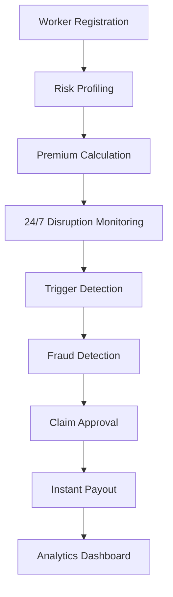

# 🛡️ Kavach: AI-Powered Insurance for E-commerce Delivery Partners

<div align="center">
  
</div>

[](https://opensource.org/licenses/MIT)
[](https://github.com/Devansh-407/kavach)
[](https://github.com/Devansh-407/kavach)

> *"When it rains heavily, I can't deliver. When there's a curfew, I can't deliver. When the app crashes, I can't deliver. Those days, I earn ZERO rupees."* - Rajesh, 28, Amazon Flex delivery partner, Mumbai

## 🎯 The Problem

**15-20 days per year lost to external disruptions**
- **₹12,000-15,000 annual income loss** per delivery partner
- **No safety net** — no paid leaves, no sick days, no insurance
- **Stress and uncertainty** affecting mental health of millions

For India's 10+ million e-commerce delivery partners, one bad day means skipping meals or borrowing money to survive.

## 💡 Our Solution: Kavach

**Kavach** is an AI-powered, parametric insurance platform that automatically compensates e-commerce delivery partners when external disruptions stop them from working. 

**No paperwork, no manual claims, no delays** — just instant income protection when they need it most.

## 🚀 Key Features

### ⚡ Instant Parametric Payouts
- **Auto-trigger** within 15 minutes of disruption
- **80% of daily earnings** credited directly to wallet
- **Zero paperwork** - completely automated

### 🤖 Multi-Layer AI Protection
- **Weather API integration** (rain, heat, AQI)
- **Crowd-sourced verification** with geotagged images
- **Platform downtime detection**
- **News/government alert monitoring**

### 🛡️ Advanced Fraud Detection
- **Digital signature verification** (video/voice biometrics)
- **GPS location validation**
- **Pattern recognition AI**
- **Network analysis for organized fraud**

### 📱 Mobile-First Design
- **Android app** (90% of delivery partners)
- **Works offline** in low-network areas
- **Regional language support**
- **UPI integration** for seamless payments

## 📊 Real-World Impact

### Scenario 1: Heavy Rain in Mumbai
```
Worker: Rajesh, Andheri East (Pincode: 400069)
Rainfall: 45mm in 2 hours
⚡ 8:00 AM: Weather API detects >35mm rain
⚡ 8:15 AM: Rajesh gets ₹960 (80% of lost income)
Result: Family fed despite not working
```

### Scenario 2: Sudden Curfew in Delhi
```
Worker: Priya, Jamia Nagar (Pincode: 110025)
8 workers report barricades in 15 minutes
⚡ 12:50 PM: Auto-trigger for entire pincode (312 workers)
⚡ 1:00 PM: Priya gets ₹440 for lost afternoon shift
Result: Community verification ensures genuine claims
```

## 💰 Sustainable Business Model

### Premium: "Pay As You Earn"
```
Weekly Premium = (Avg Weekly Deliveries × ₹5) × Location Risk Factor
Weekly Cap: ₹1,000 maximum
```

**Why ₹5 per delivery?**
- ✅ Simple: "Each delivery = 5 rupees safety"
- ✅ Fair: More deliveries = More risk = More premium
- ✅ Affordable: Only 1-2% of earnings
- ✅ Predictable: Worker knows exact cost per delivery

### Risk-Based Pricing
| City Tier | Risk Score | Multiplier | Examples |
|-----------|------------|------------|----------|
| Low Risk  | 0.0-0.2    | 0.8x       | Jaipur, Pune, Indore |
| Medium Risk | 0.2-0.5  | 1.0x       | Bangalore, Hyderabad |
| High Risk | 0.5-0.8    | 1.3x       | Mumbai, Delhi, Kolkata |
| Very High | 0.8-1.0    | 1.6x       | Coastal areas, flood zones |

## 🔄 Complete Workflow



### 4-Step Claim Process
1. **🌐 Auto-Detection**: Weather/news/crowd triggers
2. **🤖 AI Verification**: Multi-layer fraud checks
3. **⚡ Instant Approval**: >70% confidence = auto-payout
4. **💸 Immediate Transfer**: UPI/bank within 1 hour

## 🛠️ Technology Stack

### Frontend (Mobile App)
- **React Native 0.72** - Cross-platform development
- **Redux Toolkit** - State management
- **Native Modules** - Camera, GPS, biometrics
- **Material Design UI** - Indian language support

### Backend & AI/ML
- **Node.js 20 + Express** - API server
- **Python 3.11 + FastAPI** - ML services
- **PostgreSQL 15** - Primary database
- **Redis 7.x** - Caching and real-time data
- **TensorFlow 2.x** - Deep learning models
- **Scikit-learn** - Risk prediction algorithms

### APIs & Integrations
- **OpenWeatherMap** - Weather data
- **IMD Weather API** - Indian weather
- **NewsAPI.org** - Curfew/strike alerts
- **Google Maps API** - Geotagging validation
- **Razorpay** - Payment processing

## 📈 Market Opportunity

### Target Market
- **10+ million** e-commerce delivery partners in India
- **₹3,000-10,000** weekly income per partner
- **Growing 35% YoY** with e-commerce boom

### Revenue Projections
```
Year 1: 50,000 workers × ₹400 avg premium = ₹2.4CR revenue
Year 2: 200,000 workers × ₹400 avg premium = ₹9.6CR revenue
Year 3: 500,000 workers × ₹400 avg premium = ₹24CR revenue
```

### Competitive Advantage
- **First-mover advantage** in delivery partner insurance
- **AI-powered automation** vs manual competitors
- **Parametric model** vs traditional claims process
- **Mobile-first** approach for target demographic

## 🎯 Development Roadmap

### Phase 1: MVP (Weeks 1-4)
- ✅ Android app with core features
- ✅ Weather API integration
- ✅ Basic fraud detection
- ✅ UPI simulation for payouts

### Phase 2: Expansion (Weeks 5-6)
- ✅ iOS app development
- ✅ Advanced AI models
- ✅ Platform API integrations
- ✅ Analytics dashboard

### Phase 3: Scale (Post-Hackathon)
- 🔄 Multi-city expansion
- 🔄 Additional insurance products
- 🔄 B2B partnerships with platforms
- 🔄 International markets

## 👥 Team & Vision

**Our Mission**: Provide financial security to India's essential delivery workers who keep our economy moving.

**Vision**: Become the default insurance platform for 50 million gig workers across emerging markets.

## 🏆 Why Mentors Should Choose This Project

### 1. **Massive Social Impact**
- Solves real financial insecurity for millions
- Protects essential workers during disruptions
- Creates social safety net for gig economy

### 2. **Strong Technical Innovation**
- AI-powered parametric insurance model
- Multi-layer fraud detection system
- Real-time data processing at scale

### 3. **Sustainable Business Model**
- Clear revenue path with premium collection
- Scalable to millions of users
- Attractive unit economics

### 4. **Market Timing**
- Gig economy booming post-COVID
- Insurance penetration increasing in India
- Digital payments infrastructure mature

### 5. **Hackathon-Ready MVP**
- Feasible 6-week development timeline
- Clear technical milestones
- Demo-ready product with real impact

## 📞 Contact & Next Steps

**Ready to build the future of gig worker protection?**

Let's discuss how Kavach can:
- Transform financial security for delivery partners
- Create a profitable insurtech business
- Scale across emerging markets

**Project Repository**: [github.com/Devansh-407/kavach](https://github.com/Devansh-407/kavach)

---

*"Every delivery partner deserves protection against forces beyond their control. Kavach makes that possible."* 🛡️
